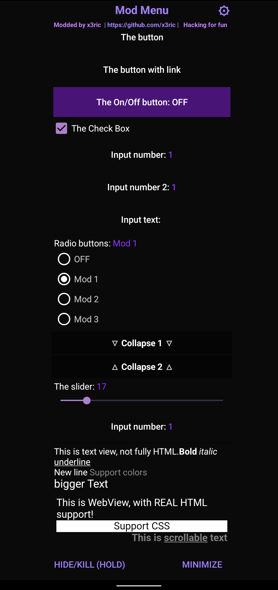

# Introduction

A **floating mod menu** designed for il2cpp and other native Android games. It includes **KittyMemory**, **MSHook**, **And64InlineHook**, and a basic string obfuscator (**AY obfuscator**). All assets are stored as base64 in the C++ code, eliminating the need to store them in the assets folder.

# Known Bugs

- **Android 11**: Spinner may not display on some devices. It should work correctly on **Android 12**.
- In some games, the menu uses outdated layouts (e.g., KitKat or Gingerbread) when launched without the proper permissions. A fix has not yet been found.

# Download

- Download the repository as a **ZIP** file or clone it using your preferred Git tools.

# Getting Started

**Start reading the documentation here:**  
[Wiki Page](https://github.com/x3ric/android-modmenu/tree/main/wiki)

# Credits

This project is inspired by contributions from several developers:

- **Octowolve/Escanor**  
  - Mod Menu: [Substrate Template](https://github.com/z3r0Sec/Substrate-Template-With-Mod-Menu)  
  - Hooking: [Substrate Hooking Example](https://github.com/z3r0Sec/Substrate-Hooking-Example)
- **VanHoevenTR**  
  - Mod Menu: [VanHoevenTR Android Mod Menu](https://github.com/x3ric/VanHoevenTR_Android_Mod_Menu)
- **MrIkso**  
  - [First Floating Mod Menu Template](https://github.com/MrIkso/FloatingModMenu)
- **MJx0 (Ruit)**  
  - [KittyMemory](https://github.com/MJx0/KittyMemory)
- **Rprop**  
  - [And64InlineHook](https://github.com/Rprop/And64InlineHook)
- Special thanks to everyone else who contributed!

This project is **based on** the original [LGLTeam Android Mod Menu](https://github.com/LGLTeam/android-mod-menu).

# Disclaimer

This project is for **educational purposes only**. The project was created for fun and learning.
